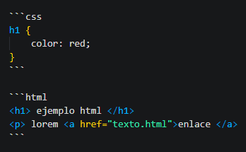

## Indice
- [Indice](#indice)
- [1. Citas](#1-citas)
- [1.1. Listas](#11-listas)
- [1.2. Enlaces](#12-enlaces)
- [1.3. Imágenes](#13-imágenes)
- [1.4. Código y bloques de código](#14-código-y-bloques-de-código)
- [1.5. Separadores](#15-separadores)
- [1.6. Emoticones](#16-emoticones)
  - [2. Tablas](#2-tablas)
  - [2.1 Listas de tareas](#21-listas-de-tareas)
  - [2.2. Referencias con sus secciones](#22-referencias-con-sus-secciones)

## 1. Citas
> **Li Europan lingues es membres del sam familie. Lor separat existentie es un myth. Por scientie, musica, sport etc, litot**
>
> *Li Europan lingues es membres del sam familie. Lor separat existentie es un 
myth. Por scientie, musica, sport etc, litot*

---
```
> **Li Europan lingues es membres del sam familie. Lor separat existentie es un myth. Por scientie, musica, sport etc, litot**
>
> *Li Europan lingues es membres del sam familie. Lor separat existentie es un 
myth. Por scientie, musica, sport etc, litot*
```

## 1.1. Listas

* Elemento 01
    * sublista 01
        1. sublista 01-1
        1. sublista 01-2
    * sublista 02
* Elemento 02
* Elemento 03

1. **item 01** 
   1. *item 02*
2. *item03*

---
```
* Elemento 01
    * sublista 01
        1. sublista 01-1
        1. sublista 01-2
    * sublista 02
* Elemento 02
* Elemento 03

1. **item 01** 
   1. *item 02*
2. *item03*
```

## 1.2. Enlaces 

* [Universidad de Cádiz](http://www.uca.es)
* [Universidad de Córdoba](http://www.uco.es)
* <http://www.google.es>

---
```
* [Universidad de Cádiz](http://www.uca.es)
* [Universidad de Córdoba](http://www.uco.es)
* <http://www.google.es>
```

## 1.3. Imágenes


---
```

```

## 1.4. Código y bloques de código

Li Europan lingues es `var x = document.querySelector("img")` membres del sam familie. Lor separat existentie es un my

```css
h1 {
    color: red;
}
```

```html
<h1> ejemplo html </h1>
<p> lorem <a href="texto.html">enlace </a>
```

~~~javascript
let x = document.querySelector("img")
~~~

---
```
Li Europan lingues es `var x = document.querySelector("img")` membres del sam familie. Lor separat existentie es un my
```



```
~~~javascript
let x = document.querySelector("img")
~~~
```

## 1.5. Separadores

lorem

----
----

ipsum

-----

```
lorem

----
----

ipsum

-----
```

## 1.6. Emoticones

Li Europan ling :smile:, ues es `var x = document.querySelector("img")` membres del sam :turtule:. familie. Lor separat existentie es un 

---
```
Li Europan ling :smile:, ues es `var x = document.querySelector("img")` membres del sam :turtule:. familie. Lor separat existentie es un 
```
### 2. Tablas

| Cabecera 1 | Cabecera 2 | Cabecera 3 |
| ---------- | ---------- | ---------- |
| Elem 1, 1  | Elem 1, 2  | Elem 1, 3  |
| Elem 2, 1  | Elem 2, 2  | Elem 2, 3  |
| Elem 3, 1  | Elem 3, 2  | Elem 3, 3  |
| Elem 4, 1  | Elem 4, 2  | Elem 4, 3  |
| Elem 5, 1  | Elem 5, 2  | Elem 5, 3  |

---
```
| Cabecera 1 | Cabecera 2 | Cabecera 3 |
| ---------- | ---------- | ---------- |
| Elem 1, 1  | Elem 1, 2  | Elem 1, 3  |
| Elem 2, 1  | Elem 2, 2  | Elem 2, 3  |
| Elem 3, 1  | Elem 3, 2  | Elem 3, 3  |
| Elem 4, 1  | Elem 4, 2  | Elem 4, 3  |
| Elem 5, 1  | Elem 5, 2  | Elem 5, 3  |
```
### 2.1 Listas de tareas

- [ ] tarea número 01
- [x] tarea número 02
- [ ] tarea número 03

---
```
- [ ] tarea número 01
- [x] tarea número 02
- [ ] tarea número 03
```
### 2.2. Referencias con sus secciones

* Aprende a [programar con PHP] [1]
* Aprende a [programar con JavaScript] [2]
* Aprende a [programar con Python] [3]

[1]: https://neoguias.com/php "Programa con PHP"
[2]: https://neoguias.com/javascript 'Programa con JavaScript'
[3]: https://neoguias.com/python (Programa con Python)

---
```
* Aprende a [programar con PHP] [1]
* Aprende a [programar con JavaScript] [2]
* Aprende a [programar con Python] [3]

[1]: https://neoguias.com/php "Programa con PHP"
[2]: https://neoguias.com/javascript 'Programa con JavaScript'
[3]: https://neoguias.com/python (Programa con Python)
```