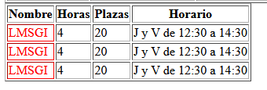

# HTML
## ¿Que es?

>   **Lorem ipsum dolor sit amet consectetur adipisicing elit. Ratione debitis, est eos
>   iste libero suscipit magnam fuga** *porro alias fugit, sequi minima* quaerat officiis 
> culpa corrupti earum optio animi natus.

* [Definición HTML](https://developer.mozilla.org/es/docs/Web/HTML)

## Listas

    Lorem ipsum dolor sit amet consectetur adipisicing elit. Ratione debitis, est eos iste libero suscipit magnam fuga porro alias fugit, sequi minima quaerat officiis culpa corrupti earum optio animi natus.
    
```HTML
    <ul>
        <li>rrupti earum</li>
        <li>rrupti earum</li>
        <li>rrupti earum</li>
        <li>rrupti earum</li>
    </ul>
     <ol>
        <li>Lorem ipsum</li>
        <li>Lorem ipsum</li>
        <li>Lorem ipsum</li>
        <li>Lorem ipsum</li>
    </ol>
```


## Tablas
   * Como se hace en HTML

```HTML
    <table border="1"> <!-- SCOPE COL ES PARA IDENTIFICAR CABEZERAS DE COLUMNAS Y SCOPE ROW PARA CABEZERAS DE FILAS -->
        <tr>
            <th scope="col">Nombre</th>
            <th scope="col">Horas</th>
            <th scope="col">Plazas</th>
            <th scope="col">Horario</th>
        </tr>

        <tr>
            <th scope="row">LMSGI</th>
            <td>4</td>
            <td>20</td>
            <td>J y V de 12:30 a 14:30</td>
        </tr>

        <tr>
            <th scope="row">LMSGI</th>
            <td>4</td>
            <td>20</td>
            <td>J y V de 12:30 a 14:30</td>
        </tr>

        <tr>
            <th scope="row">LMSGI</th>
            <td>4</td>
            <td>20</td>
            <td>J y V de 12:30 a 14:30</td>

        </tr>
    </table>
```
  * Como se veria:
  
   


  * Como se hace en markdown 
``` 
| Nombre |  Horas  | Plazas |        Horario         |
| ------ |  -----  | ------ |        -------         |
| LMSGI  |    4    |   20   | J y V de 12:30 a 14:30 |
| LMSGI  |    4    |   20   | J y V de 12:30 a 14:30 |
| LMSGI  |    4    |   20   | J y V de 12:30 a 14:30 |
```
* Como se veria:
         
| Nombre |  Horas  | Plazas |        Horario         |
| ------ |  -----  | ------ |    ------------------  |
| LMSGI  |    4    |   20   | J y V de 12:30 a 14:30 |
| LMSGI  |    4    |   20   | J y V de 12:30 a 14:30 |
| LMSGI  |    4    |   20   | J y V de 12:30 a 14:30 |

